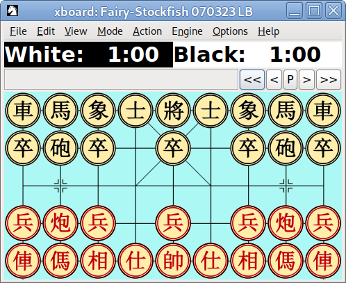

# crowded-xiangqi-tests



Tests for Crowded Xiangqi, defined as:

```ini
# Chinese Chess on half the board (5 × 9 intersections)
# Pawns (soldiers) are set to display as archbishops (via pieceToCharTable)
# so that WinBoard/XBoard won't disappear them on the last rank.
# https://github.com/fairy-stockfish/Fairy-Stockfish/issues/180#issuecomment-692910150
[crowdedxiangqi:xiangqi]
pieceToCharTable = .N.R.ABP.K.C...........n.r.abp.k.c..........
maxRank = 5
startFen = rnbakabnr/pcp1p1pcp/9/PCP1P1PCP/RNBAKABNR w - - 0 1
mobilityRegionBlackKing = d3 e3 f3 d4 e4 f4 d5 e5 f5
mobilityRegionBlackFers = d3 e3 f3 d4 e4 f4 d5 e5 f5
mobilityRegionBlackElephant = *1 *2 *3 *4 *5
soldierPromotionRank = 4
```

See:

- <https://yawnoc.github.io/crowded-xiangqi>
- <https://github.com/fairy-stockfish/Fairy-Stockfish/wiki/Variant-configuration>


## Statistics

<!-- Start of Table -->
| OS & Engine | Opening & Time Control | Total Games | Red Wins | Black Wins | Draws |
| - | - | - | - | - | - |
| deb10-fsf070323lb | centrepawn-1m0s | 100 | 78 | 3 | 19 |
| deb10-fsf070323lb | default-1m0s | 100 | 13 | 36 | 51 |
| deb10-fsf070323lb | leftcannon-1m0s | 100 | 34 | 14 | 52 |
| deb10-fsf070323lb | rightcannon-1m0s | 100 | 23 | 29 | 48 |
| deb10-fsf070323lb | rightelephant-1m0s | 50 | 25 | 19 | 6 |
| win10-fsf14.0.1xq | default-30m20s | 65 | 7 | 28 | 30 |
<!-- End of Table -->

This table can be updated automatically by running `./tabulate.py`.
